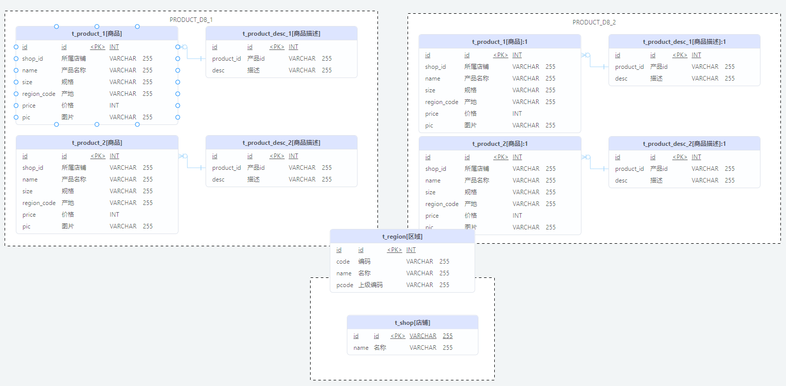

# 分库分表说明



## 垂直分库
商品与店铺信息进行了垂直分库，分为了 PRODUCT_DB(商品库)和STORE_DB(店铺库)

## 垂直分表
商品信息进行了垂直分表，分为了商品基本信息（t_product）和商品描述信息(t_product_desc)

## 水平分库
考虑到商品信息的数据增长

对PRODUCT_DB(商品库)进行了水平分库，分片键使用店铺id，分片策略为 `店铺id%2+1`。
因此商品描述信息对所有店铺id进行了冗余。

对商品基本信息(t_product)和商品描述信息(t_product_desc)进行了水平分表，分片键使用商品id，分片策略为 `商品id%2+1`。并将这两张表设置为绑定表，避免笛卡尔积join.

为避免主键冲突，id生成策略采用雪花算法来生成全局唯一id.

## 公共表
区域信息


要求读写分离提升性能

# 环境搭建

首先启动容器
```
cd docker
docker-compose up -d
```

然后配置从库s0,s1,s2
先看 m0 状态
```
C:\Users\wz589>mysql -h 127.0.0.1 -P3306 -u root -p
Enter password: ******

mysql> show master status;
+-----------------------+----------+--------------+------------------+-------------------+
| File                  | Position | Binlog_Do_DB | Binlog_Ignore_DB | Executed_Gtid_Set |
+-----------------------+----------+--------------+------------------+-------------------+
| test-mysql-bin.000003 |      154 |              | mysql            |                   |
+-----------------------+----------+--------------+------------------+-------------------+
1 row in set (0.00 sec)

```
配置s0
```
C:\Users\wz589>mysql -h 127.0.0.1 -P3307 -u root -p
Enter password: ******

mysql> change master to master_host='m0', master_user='slave', master_password='123456', master_port=3306, master_log_file='test-mysql-bin.000003', master_log_pos=154, master_connect_retry=30;
Query OK, 0 rows affected, 1 warning (0.06 sec)

mysql> start slave;
Query OK, 0 rows affected (0.01 sec)

mysql> show slave status \G;
*************************** 1. row ***************************
               Slave_IO_State: Waiting for master to send event
                  Master_Host: m0
                  Master_User: slave
                  Master_Port: 3306
                Connect_Retry: 30
              Master_Log_File: test-mysql-bin.000003
          Read_Master_Log_Pos: 154
               Relay_Log_File: edu-mysql-relay-bin.000002
                Relay_Log_Pos: 325
        Relay_Master_Log_File: test-mysql-bin.000003
             Slave_IO_Running: Yes
            Slave_SQL_Running: Yes
              Replicate_Do_DB:
          Replicate_Ignore_DB:
```


与 s0配置方式类似，配置s1,s2

s1
```
 change master to master_host='m1', master_user='slave', master_password='123456', master_port=3306, master_log_file='test-mysql-bin.000003', master_log_pos=154, master_connect_retry=30;
```
s2
```
 change master to master_host='m2', master_user='slave', master_password='123456', master_port=3306, master_log_file='test-mysql-bin.000003', master_log_pos=154, master_connect_retry=30;
```

接下来，可以跑 test　目录下的测试用例了